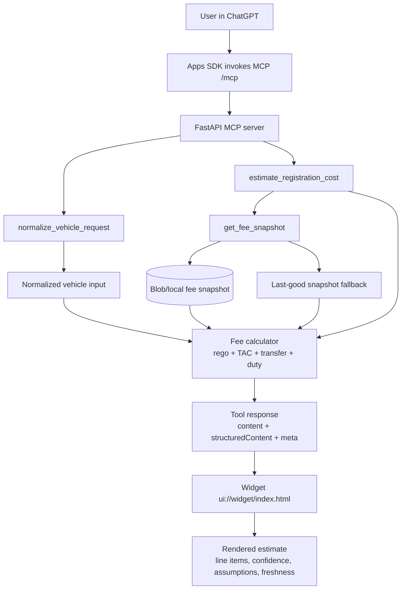

# Vic Rego Estimator

Production-minded monorepo for an Apps in ChatGPT integration that estimates Victorian registration costs.

## Repository tree

```text
.
├── deploy/
│   ├── Dockerfile
│   └── azure_deploy.md
├── server/
│   ├── pyproject.toml
│   ├── src/vic_rego_estimator/
│   │   ├── main.py
│   │   ├── config.py
│   │   ├── models/schemas.py
│   │   ├── scraping/{sources.py,parser.py}
│   │   ├── storage/snapshot_store.py
│   │   ├── tools/{normalize.py,estimator.py,registry.py}
│   │   └── static/widget/
│   └── tests/
│       ├── test_tools_contract.py
│       └── test_scraping_parser.py
└── ui/
    ├── index.html
    ├── vite.config.ts
    └── src/
        ├── widget.ts
        └── components/lineItems.ts
```

## End-to-end workflow

```text
[User in ChatGPT]
        |
        v
[Apps SDK calls MCP over /mcp]
        |
        v
[FastAPI MCP server]
  - initialize / tools/list / tools/call
        |
        +--> [normalize_vehicle_request]
        |         |
        |         v
        |   Normalized inputs
        |
        +--> [estimate_registration_cost]
                  |
                  +--> [get_fee_snapshot]
                  |         |
                  |         +--> Blob/local cached snapshot
                  |         +--> Last-good fallback if refresh fails
                  |
                  +--> Fee calculator (rego + TAC + transfer + duty)
                  |
                  v
          structuredContent + meta
                  |
                  v
[Widget (ui://widget/index.html)]
  - Itemized line items
  - Confidence + assumptions
  - Data freshness
```



## Architecture highlights

- **One-way data flow:** MCP tool outputs are rendered in widget UI; UI does not fetch external data.
- **No user data retention:** tools are stateless and no persistence for user inputs.
- **No analytics:** no telemetry scripts or tracking IDs in UI/server.
- **Redacted logs:** middleware logs method/path only, never body fields.
- **Refresh strategy:** monthly scrape from VicRoads/SRO pages and Blob cache with *last good snapshot* fallback.
- **Protected MCP endpoint:** optional OIDC JWT validation for `/mcp` with RFC 6750 bearer challenges.

## Authentication configuration

Set these environment variables to protect `/mcp` with OIDC:

- `AUTH_ENABLED=true`
- `OIDC_ISSUER=https://<tenant>/`
- `OIDC_AUDIENCE=<api-audience>`
- `OIDC_CLIENT_ID=<oauth-client-id>`
- `OIDC_JWKS_URL=https://<tenant>/.well-known/jwks.json`
- Optional:
  - `OIDC_AUTHORIZATION_URL=https://<tenant>/authorize`
  - `OIDC_REQUIRED_SCOPE=mcp:invoke`
  - `OIDC_ALGORITHMS=["RS256"]`

When auth is enabled, `/mcp` requires a valid bearer token and returns a `WWW-Authenticate` challenge with OIDC authorization details when authentication fails.

## Tool contract

Methods exposed via `/mcp` (JSON-RPC style):

1. `initialize` (returns protocol version, server capabilities, and security schemes)
2. `tools/list`
3. `tools/call`

Tool names returned by `tools/list`:

1. `normalize_vehicle_request`
2. `get_fee_snapshot`
3. `estimate_registration_cost`
4. `explain_assumptions`

Each tool descriptor includes `name`, `description`, `inputSchema`, `annotations`, and `securitySchemes`.

Each tool call returns:

- `content`: concise model-facing summary
- `structuredContent`: strict JSON object for UI rendering
- `meta`: includes `openai_output_template`, `widgetDescription`, and `data_freshness`

## Example tool response: renewal (known fields)

```json
{
  "content": "Estimated VIC cost 1460.00-1460.00 AUD (high confidence).",
  "structuredContent": {
    "estimate": {
      "transaction_type": "renewal",
      "vehicle_category": "passenger_car",
      "total_min": 1460.0,
      "total_max": 1460.0,
      "confidence": "high",
      "confidence_score": 1.0,
      "line_items": [
        {"key": "registration_fee", "label": "Registration fee", "amount_min": 930.0, "amount_max": 930.0, "source": "https://www.vicroads.vic.gov.au/registration/fees-and-payments", "mandatory": true},
        {"key": "tac_charge", "label": "TAC charge", "amount_min": 530.0, "amount_max": 530.0, "source": "https://www.vicroads.vic.gov.au/registration/fees-and-payments", "mandatory": true}
      ],
      "assumptions": [],
      "concessions_applied": [],
      "last_refresh": "2026-01-10T00:00:00Z",
      "source_urls": [
        "https://www.vicroads.vic.gov.au/registration/fees-and-payments",
        "https://www.vicroads.vic.gov.au/registration/registration-fees/heavy-vehicle-fees",
        "https://www.vicroads.vic.gov.au/registration/fees-and-payments/transfer-fees",
        "https://www.sro.vic.gov.au/motor-vehicle-duty"
      ]
    }
  },
  "meta": {
    "openai_output_template": "ui://widget/index.html",
    "widgetDescription": "Vic Rego Estimator widget with form, itemised fee breakdown, confidence and assumptions.",
    "data_freshness": {"status": "snapshot", "last_refresh": "2026-01-10T00:00:00Z", "refresh_policy": "monthly"}
  }
}
```

## Example tool response: transfer (unknown market value)

```json
{
  "content": "Estimated VIC cost 1396.70-2862.70 AUD (low confidence).",
  "structuredContent": {
    "estimate": {
      "transaction_type": "transfer",
      "vehicle_category": "passenger_car",
      "total_min": 1396.7,
      "total_max": 2862.7,
      "confidence": "low",
      "confidence_score": 0.55,
      "line_items": [
        {"key": "registration_fee", "label": "Registration fee", "amount_min": 930.0, "amount_max": 930.0, "source": "https://www.vicroads.vic.gov.au/registration/fees-and-payments", "mandatory": true},
        {"key": "tac_charge", "label": "TAC charge", "amount_min": 530.0, "amount_max": 530.0, "source": "https://www.vicroads.vic.gov.au/registration/fees-and-payments", "mandatory": true},
        {"key": "transfer_fee", "label": "Transfer fee", "amount_min": 46.7, "amount_max": 46.7, "source": "https://www.vicroads.vic.gov.au/registration/fees-and-payments/transfer-fees", "mandatory": true},
        {"key": "motor_vehicle_duty", "label": "Motor vehicle duty (stamp duty)", "amount_min": 420.0, "amount_max": 1356.0, "source": "https://www.sro.vic.gov.au/motor-vehicle-duty", "mandatory": true}
      ],
      "assumptions": [
        "Market value unknown; motor vehicle duty estimated as a range.",
        "Used $10k-$45k market value range for duty."
      ],
      "concessions_applied": [],
      "last_refresh": "2026-01-10T00:00:00Z",
      "source_urls": [
        "https://www.vicroads.vic.gov.au/registration/fees-and-payments",
        "https://www.vicroads.vic.gov.au/registration/registration-fees/heavy-vehicle-fees",
        "https://www.vicroads.vic.gov.au/registration/fees-and-payments/transfer-fees",
        "https://www.sro.vic.gov.au/motor-vehicle-duty"
      ]
    }
  },
  "meta": {
    "openai_output_template": "ui://widget/index.html",
    "widgetDescription": "Vic Rego Estimator widget with form, itemised fee breakdown, confidence and assumptions.",
    "data_freshness": {"status": "snapshot", "last_refresh": "2026-01-10T00:00:00Z", "refresh_policy": "monthly"}
  }
}
```

## Testing plan

- Contract tests for MCP methods and tool schemas (`server/tests/test_tools_contract.py`).
- Scraping parser tests for HTML table extraction and numeric normalization (`server/tests/test_scraping_parser.py`).
- Recommended CI sequence:
  1. `pytest server/tests`
  2. `npm --prefix ui run build`
  3. smoke: `uvicorn vic_rego_estimator.main:app --host 0.0.0.0 --port 8080`

## ChatGPT app quality control verification

The following controls are implemented and test-covered:

- **Privacy disclosure:** request audit logs include `request_id`, `client_ip`, `authenticated_sub`, `method`, `path`, `status_code`, and `latency_ms`.
- **Abuse controls:** configure `MCP_RATE_LIMIT_REQUESTS` and `MCP_RATE_LIMIT_WINDOW_SECONDS`; `/mcp` enforces 429 with `Retry-After`.
- **Authentication failure UX:** bearer challenges include actionable `WWW-Authenticate` fields for connector remediation.
- **Error UX states:** `/mcp` errors return concise `recovery_steps` for unsupported method (400), unknown tool (404), rate limit (429), and internal error (500).
- **Correlation/auditability:** `X-Request-ID` is echoed if supplied and generated when absent; responses include request IDs in error payloads.

Operational policy for production:
- Retain request audit logs for 30 days.
- Limit log access via least-privilege RBAC (support read-only, SRE write/admin).
- Add `X-Request-ID` to incident tickets/runbooks so support can quickly trace requests in logs.
